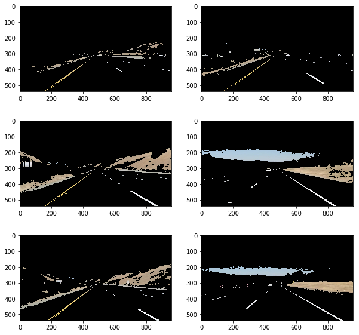
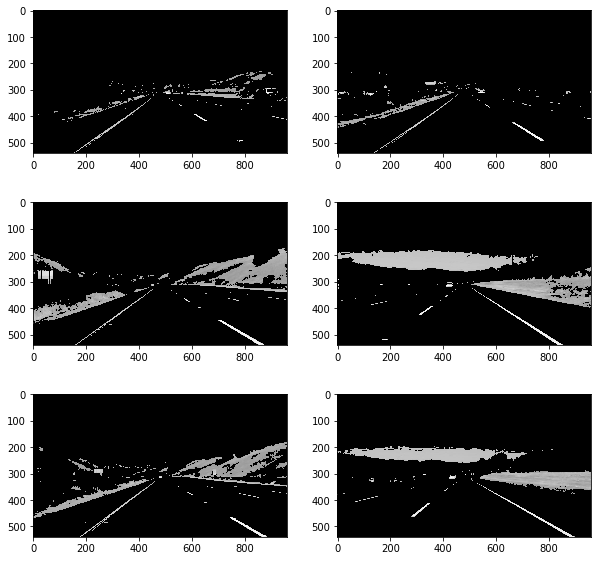
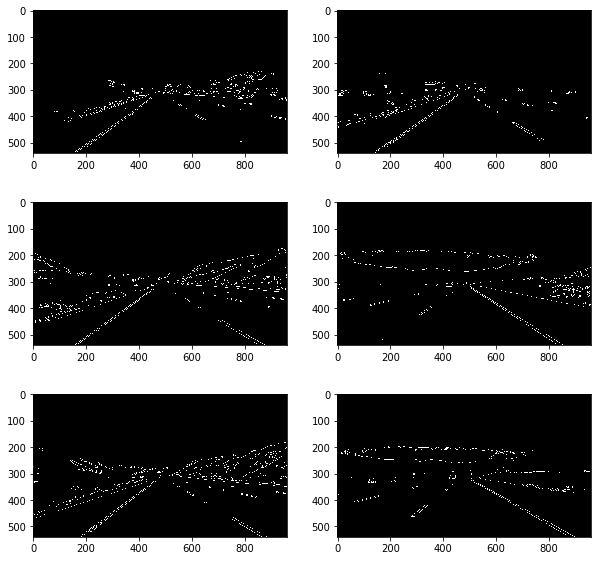
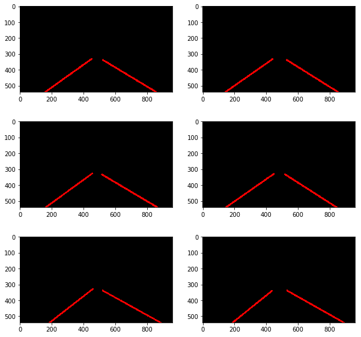

# **Finding Lane Lines on the Road** 

Reflection
---

This project explores how to find lane lines on a road using Computer Vision techniques. This is done using the OpenCV library in Python.

The processing pipeline uses the following methods:

1. Extract colour with HLS colour spaces combined with x sobel gradient.

2. Converting the image to grayscale.

2. Canny Edge Detection

3. Select a region of interest

4. Detecting lines using Hough Transform

#### Analyse the Input

#### Extract colours of Interest

#### Convert Input to Grayscale

#### Apply a Gaussian Blur 

#### Do Edge detection using the Canny transform

#### Apply a Hough transform to detect the lines from the image. Analyse the slope of the lines and draw them out with their weighted average 

#### View the output 

## Video Output

Shortcomings of the approach used in this project
-------------------------------------------------

1. Flawed lane detection in bends
The approached used in this project will have reduced accuracy as the lanes get curved. The region of interest will capture less of the lanes on steep bends

2. The approach currently struggles under different road surfaces. 

Suggested Improvement
---------------------

1. Analyse the curvature on the road and draw a polyline instead of one straight line

2. Explore other colour spaces to help identify lanes in various road and lighten conditions.

Running this Project
--------------------

**Step 1:** Set up the environment from the environment.yml file provided using [Conda](https://conda.io/docs/user-guide/tasks/manage-environments.html).

**Step 2:** Open the code in a Jupyter Notebook
If you are unfamiliar with Jupyter Notebooks, check out <A HREF="https://www.packtpub.com/books/content/basics-jupyter-notebook-and-python" target="_blank">Cyrille Rossant's Basics of Jupyter Notebook and Python</A> to get started.

`> jupyter notebook`

A browser window will appear showing the contents of the current directory.  Click on the file called "P1.ipynb".  Another browser window will appear displaying the notebook.  

**Step 3:** Run the cells
